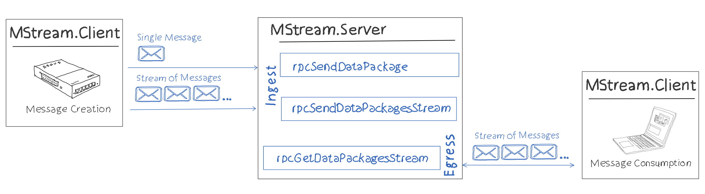
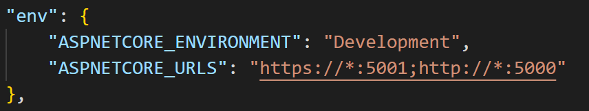
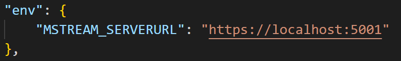

# Simplified gRPC streaming example 
## Environment 
- ASP.NET Core 6.0
- .NET 6.0
- proto3

## Demo Scenario
### Overview


### Protocol Buffers Contract (proto file)
The proto file defines two services (Ingest & Egress) and thre rpc functions: 
```
service Ingest {
  rpc SendDataPackage (SendDataPackage_Request) returns (SendDataPackage_Response);
  rpc SendDataPackagesStream (stream SendDataPackage_Request) returns (SendDataPackage_Response);
}

service Egress {
    rpc GetDataPackagesStream (GetDataPackage_Request) returns (stream GetDataPackage_Response);
}
```
`SendDataPackage`: Ingests a single data package from the message creating application (MStream.Client) to a server (MStream.Server)

`SendDataPackageStream`: Sends a stream of data packages from the message creating application (MStream.Client) to the message receiving application (MStream.Server).

`GetDataPackagesStream`: Egresses a stream of data packages from a server (MStream.Server) to a message consuming application (MStream.Client)

### Applications

| Application / Folder | Functionality |
|----------------------|:-------------:|
| ./src/MStream.Client | c# console application which sends a single data package and a stream of data packages to MStream.Server |
| ./src/MStream.Server | c# ASP.NET application which retrieves a single data package, retrieves a stream of data packages and provides a stream of data packages to MStream.Client |
| ./src/MStream.Contract | [Protocol Buffers contract file](./src/MStream.Contract/dataSrv.proto) |

## Demo Environment
Ensure that .NET dev certs are up to date / registered. 
```
dotnet dev-certs https --clean   
dotnet dev-certs https --trust  
```

- Start debugging of MStream.Server within Visual Studio. ASPNETCore_URLS is configured in [launch.json](./.vscode/launch.json) for MStream.Server to listen on https://*:5001

  

- Start debugging of MStream.Client within Visual Studio. MStream.Client opens a gRPC connection to a server specified in the configuration variable MSTREAM_SERVERURL. 


- Both environment variables are already set in [launch.json](./.vscode/launch.json)

- MStream.Client supports the following command line parameter
  ```
  dotnet run -- senddata
  dotnet run -- sendstream 
  dotnet run -- getstream
  ```
  to ingest a single data package (senddata), to ingest a stream of data packages (sendstream) or to retrieve a stream of data packages (getstream) from the server. 
  